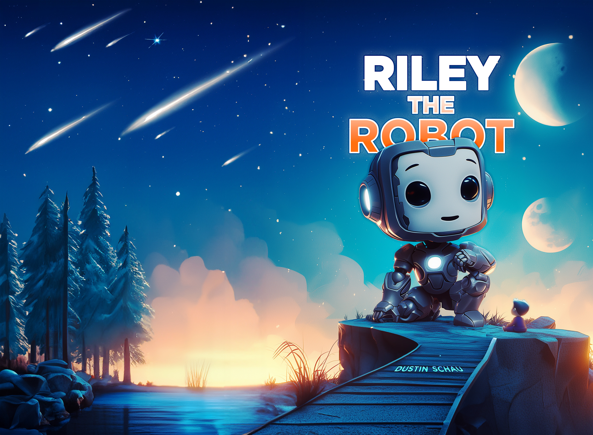

## Riley the Robot

A children's book about a few life lessons.

## Usage

This was mostly just my exploration with AI, particularly Midjourney and a little ChatGPT. Feel free to use whatever, although it requires some assembly (InDesign, book printing, etc.)

Explaining a few areas:

- [Images](./images/)
    - All images were generated with Midjourney and then Photoshop. The Photoshop files are not included just because they're too large for GitHub
- [interior.pdf](./interior.pdf)
    - This is the book contents. It includes all the images, the copy, and so forth. You can think of this primarily as "the book."
- [cover.pdf](./cover.pdf)
    - This is the hardcover book cover. If you print using something like Lulu it'll be "wrapped" to create the book cover. It was also generated with Midjourney and lots of tweaks with Photoshop
- [cover-dust-jacket.pdf](./cover-dust-jacket.pdf)
    - This is the "dust jacket" cover. It's a printed piece of paper wrapped around a nylon book that is a bit higher quality. If you care deeply about quality and want to create more of an heirloom, I'd recommend using this version!

## Printing

I recommend [lulu](https://lulu.com). I've included a few variants for the cover, specifically:

- Hardcover: [cover.pdf](./cover.pdf)
- Dust Jacket: [dust-jacket](./cover-dust-jacket.pdf)

For both, the same interior.pdf will be used. If you'd like to make any changes (please fork and then I'd love to see what you create!), use the InDesign files to re-create them. You may need to download the Lulu templates to export, and they are available [for download on Lulu here][lulu-download].

[lulu-download]: https://www.lulu.com/publishing-toolkit

## License

[See LICENSE](./LICENSE)
